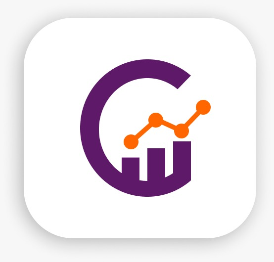

<div align="center">

<!-- Logo -->


<br/>

# CoDataU

### Dashboard de Análisis de Datos con Inteligencia Artificial

[](https://python.org)
[](https://flask.palletsprojects.com)
[](https://pandas.pydata.org)
[](https://duckdb.org)
[](https://sqlite.org)
[](https://chartjs.org)

<br/>

**Proyecto de Grado — Décimo Semestre**  
**Universidad — Ingeniería / Tecnología en Sistemas**  
**Autor: Kevin Santiago Sarmiento Rincón**

<br/>

[🚀 Demo en vivo](#) · [📖 Documentación](#documentación) · [🐛 Reportar bug](../../issues) · [💡 Sugerir feature](../../issues)

</div>

---

## 📋 Tabla de Contenidos

- [Sobre el Proyecto](#-sobre-el-proyecto)
- [¿Qué problema resuelve?](#-qué-problema-resuelve)
- [Funcionalidades](#-funcionalidades)
- [Stack Tecnológico](#-stack-tecnológico)
- [Arquitectura del Sistema](#-arquitectura-del-sistema)
- [Estructura del Proyecto](#-estructura-del-proyecto)
- [Instalación y Configuración](#-instalación-y-configuración)
- [Uso](#-uso)
- [Capturas de Pantalla](#-capturas-de-pantalla)
- [API de Rutas](#-api-de-rutas)
- [Base de Datos](#-base-de-datos)
- [Autor](#-autor)
- [Contexto Académico](#-contexto-académico)
- [Licencia](#-licencia)

---

## 🎯 Sobre el Proyecto

**CoDataU** (Company Data University) es una aplicación web de análisis de datos con inteligencia artificial, desarrollada como proyecto de grado universitario. La plataforma permite a usuarios —especialmente pequeñas y medianas empresas— cargar archivos de datos en formato CSV y Excel, procesarlos automáticamente, visualizar métricas en un dashboard interactivo y obtener insights generados por IA, todo desde una interfaz moderna e intuitiva sin necesidad de conocimientos técnicos.

El proyecto nació de la necesidad de democratizar el análisis de datos: herramientas como Power BI, Tableau o Google Data Studio son poderosas pero complejas y costosas para la mayoría de las PYMES. CoDataU propone una alternativa accesible que entrega valor en segundos, sin configuraciones complejas ni curvas de aprendizaje elevadas.

> *"Datos + Análisis + Inteligencia"* — lema de CoDataU

---

## 🔍 ¿Qué problema resuelve?

Las PYMES generan datos constantemente (ventas, gastos, inventarios, nóminas), pero la gran mayoría **no tiene herramientas para analizarlos sistemáticamente**. Esto genera:

- ❌ Toma de decisiones basada en intuición en lugar de evidencia
- ❌ Errores no detectados: valores nulos, duplicados, inconsistencias
- ❌ Oportunidades de mejora perdidas por falta de visualización
- ❌ Tiempo invertido en análisis manuales en hojas de cálculo

**CoDataU resuelve esto en 3 pasos:**

```
1. Sube tu archivo CSV o Excel
         ↓
2. El motor lo analiza automáticamente
         ↓
3. Visualiza gráficas, insights y descarga el reporte limpio
```

---

## ✨ Funcionalidades

### 🔐 Autenticación
- [x] Registro de usuario con validación de email y username únicos
- [x] Inicio de sesión con contraseña hasheada (bcrypt via Werkzeug)
- [x] Cierre de sesión seguro
- [x] Protección de rutas con `@login_required`
- [x] Protección CSRF en todos los formularios (Flask-WTF)
- [x] Edición de perfil (nombre de usuario)
- [x] Cambio de contraseña con verificación de contraseña actual

### 📁 Gestión de Archivos
- [x] Carga de archivos `.csv`, `.xls`, `.xlsx` (hasta 50 MB)
- [x] Nombres únicos UUID para evitar colisiones
- [x] Vista de todos los archivos con acciones: ver, activar, eliminar
- [x] Eliminación de archivos (físico + registro en BD)

### 🧪 Procesamiento de datos (pandas + DuckDB)
- [x] Lectura automática con detección de encoding (UTF-8 / Latin-1)
- [x] Limpieza automática: eliminar filas/columnas vacías, strip de texto
- [x] Persistencia analítica en Parquet comprimido con Zstandard
- [x] Perfil estructurado con tipos, nulos, cardinalidad, duplicados y muestra
- [x] Inferencia semántica y plan de limpieza seguro (`automatic` / revisión / IA)
- [x] Detección de valores nulos y filas duplicadas
- [x] Cálculo de estadísticas: suma, promedio, mínimo, máximo por columna
- [x] Generación de datos para gráficas (promedios, agrupaciones)
- [x] Identificación del tipo de datos (ventas, gastos, productos, etc.)

### 📊 Dashboard Interactivo
- [x] Selector de archivo activo con chips intercambiables
- [x] 4 KPI cards: filas, columnas, nulos, duplicados
- [x] Gráfica de barras: promedio por columna numérica
- [x] Gráfica de dona: distribución agrupada por categoría
- [x] Gráfica de nulos por columna
- [x] Panel de Sugerencias IA
- [x] Tabla de resumen estadístico
- [x] Vista previa de las primeras 10 filas

### 🤖 Insights automáticos (base para IA)
- [x] Identificación automática del tipo de archivo
- [x] Sugerencias de mejora categorizadas (success / warning / danger / info)
- [x] Alertas de calidad: nulos, duplicados, filas insuficientes
- [x] Análisis de valores extremos por columna numérica
- [x] Insights persistentes en base de datos

### 📄 Reportes
- [x] Listado completo de archivos con métricas
- [x] Estadísticas globales: total de archivos, registros y procesados
- [x] Descarga de CSV procesado y limpio (UTF-8 con BOM para Excel)

---

## 🛠 Stack Tecnológico

| Categoría | Tecnología | Versión |
|-----------|-----------|---------|
| **Lenguaje** | Python | 3.13 |
| **Framework web** | Flask | 3.x |
| **ORM** | SQLAlchemy | 3.x |
| **Base de datos** | SQLite | 3.x |
| **Autenticación** | Flask-Login + Werkzeug | — |
| **Formularios** | Flask-WTF | — |
| **Procesamiento datos** | pandas + DuckDB + Parquet | 2.2 / 1.5 / — |
| **Frontend CSS** | Sistema propio (Inter) | — |
| **Gráficas** | Chart.js | 4.4.1 |
| **Iconos** | Bootstrap Icons | 1.11.0 |
| **Tipografía** | Inter (Google Fonts) | — |
| **Control de versiones** | Git + GitHub | — |

---

## 🏗 Arquitectura del Sistema

CoDataU implementa el patrón **MVC** con **Application Factory** de Flask:

```
┌─────────────────────────────────────────────────────────┐
│                     CLIENTE (Navegador)                  │
│              HTML + CSS + Chart.js + Jinja2              │
└──────────────────────────┬──────────────────────────────┘
                           │ HTTP Request
┌──────────────────────────▼──────────────────────────────┐
│                    FLASK APPLICATION                      │
│                                                          │
│  ┌─────────────────────────────────────────────────┐    │
│  │              Application Factory                 │    │
│  │              app/__init__.py                     │    │
│  └──────────┬──────────────────────────────────────┘    │
│             │                                            │
│  ┌──────────▼──────────────────────────────────────┐    │
│  │                   BLUEPRINTS                     │    │
│  │  auth_bp │ dashboard_bp │ files_bp │ reports_bp  │    │
│  └──────────┬──────────────────────────────────────┘    │
│             │                                            │
│  ┌──────────▼──────────────────────────────────────┐    │
│  │                   SERVICES                       │    │
│  │ DataService │ DatasetPipeline │ StorageService   │    │
│  │ ValidationService │ AIService                      │    │
│  └──────────┬──────────────────────────────────────┘    │
│             │                                            │
│  ┌──────────▼──────────────────────────────────────┐    │
│  │                    MODELS                        │    │
│  │         User │ FileUpload │ AIInsight            │    │
│  └──────────┬──────────────────────────────────────┘    │
└─────────────┼───────────────────────────────────────────┘
              │
┌─────────────▼───────────────────────────────────────────┐
│                       DATOS                              │
│ SQLite (usuarios/metadatos) │ uploads/ (originales)      │
│ artifacts/ (Parquet canónico + perfil JSON)              │
└─────────────────────────────────────────────────────────┘
```

### Flujo de procesamiento de un archivo

```
Usuario sube archivo
       ↓
Flask-WTF valida el formulario + tipo de archivo
       ↓
Original inmutable guardado con nombre UUID en uploads/
       ↓
DataService.read_file() → pandas lee CSV/XLS/XLSX
       ↓
ValidationService.validate_file() → detecta errores
       ↓
DataService.clean_dataframe() → normaliza datos
       ↓
DatasetPipeline → DuckDB escribe Parquet y genera el perfil
       ↓
La aplicación consulta el Parquet; la IA podrá consumir perfil + muestra
       ↓
AIService.generate_insights() → genera insights basados en reglas
       ↓
FileUpload + AIInsight guardados en SQLite
       ↓
Redirect a /files/results/<id> con todos los resultados
```

---

## 📁 Estructura del Proyecto

```
pymes_ai/
│
├── app/
│   ├── __init__.py              # Application Factory
│   ├── config.py                # Configuraciones por entorno
│   ├── extensions.py            # db, login_manager, csrf
│   │
│   ├── models/
│   │   ├── __init__.py
│   │   ├── user.py              # Modelo User
│   │   ├── file_upload.py       # Modelo FileUpload
│   │   └── ai_insight.py        # Modelo AIInsight
│   │
│   ├── routes/
│   │   ├── auth.py              # Blueprint: /auth/*
│   │   ├── dashboard.py         # Blueprint: /dashboard
│   │   ├── files.py             # Blueprint: /files/*
│   │   └── reports.py           # Blueprint: /reports/*
│   │
│   ├── services/
│   │   ├── data_service.py      # Procesamiento con pandas
│   │   ├── dataset_pipeline.py  # Parquet y perfilado con DuckDB
│   │   ├── storage_service.py   # Abstracción de almacenamiento local
│   │   ├── validation_service.py # Validación de calidad
│   │   └── ai_service.py        # Generación de insights IA
│   │
│   ├── forms/
│   │   ├── auth_forms.py        # Login, Register, EditProfile, ChangePassword
│   │   └── file_forms.py        # UploadForm
│   │
│   ├── templates/
│   │   ├── base.html            # Layout base con navbar horizontal
│   │   ├── auth/
│   │   │   ├── inicio.html      # Landing page
│   │   │   ├── login.html       # Inicio de sesión (split-screen)
│   │   │   ├── register.html    # Registro (split-screen)
│   │   │   ├── bienvenida.html  # Página de bienvenida post-login
│   │   │   ├── edit_profile.html
│   │   │   └── change_password.html
│   │   ├── dashboard/
│   │   │   └── index.html       # Dashboard con Chart.js
│   │   ├── files/
│   │   │   ├── upload.html      # Carga de archivos
│   │   │   ├── results.html     # Resultados del archivo
│   │   │   └── insights.html    # Análisis IA detallado
│   │   └── reports/
│   │       └── index.html       # Lista de reportes + descarga CSV
│   │
│   └── static/
│       ├── css/
│       │   └── main.css         # Sistema de diseño CoDataU
│       └── img/
│           ├── isotipo.png      # Ícono de la app
│           └── logo_full.png    # Logo horizontal
│
├── instance/
│   └── pymes_ai.db              # Base de datos SQLite (auto-generada)
│
├── uploads/                     # Archivos subidos por usuarios
├── artifacts/                   # Parquet y perfiles (auto-generados)
├── docs/architecture/           # Decisiones técnicas del pipeline
│
├── .env                         # Variables de entorno (NO subir a Git)
├── .env.example                 # Plantilla de variables de entorno
├── .gitignore
├── requirements.txt
├── requirements-dev.txt         # Dependencias de pruebas
├── pytest.ini                   # Configuración de pytest
├── tests/                       # Pruebas automatizadas
├── run.py                       # Punto de entrada
└── README.md
```

---

## ⚙️ Instalación y Configuración

### Prerrequisitos

- Python 3.10 o superior (probado también con Python 3.14)
- pip
- Git

### 1. Clonar el repositorio

```bash
git clone https://github.com/TheBlackFenix/codatau.git
cd codatau
```

### 2. Crear y activar entorno virtual

```bash
# Windows
python -m venv venv
venv\Scripts\activate

# macOS / Linux
python3 -m venv venv
source venv/bin/activate
```

### 3. Instalar dependencias

```bash
pip install -r requirements.txt
```

Para desarrollo y pruebas:

```bash
pip install -r requirements-dev.txt
pytest
```

### 4. Configurar variables de entorno

Copia el archivo de ejemplo y edítalo:

```bash
# Windows
copy .env.example .env

# macOS / Linux
cp .env.example .env
```

Edita `.env` con tus valores:

```env
FLASK_APP=run.py
FLASK_ENV=development
SECRET_KEY=tu-clave-secreta-muy-larga-y-segura
DATABASE_URL=sqlite:///pymes_ai.db
MAX_CONTENT_LENGTH=52428800
UPLOAD_FOLDER=uploads
ANALYTICS_FOLDER=artifacts
PROFILE_SAMPLE_SIZE=12
```

> ⚠️ **Nunca subas el archivo `.env` a GitHub.** Ya está incluido en `.gitignore`.

### 5. Ejecutar la aplicación

```bash
python run.py
```

La aplicación estará disponible en: **http://127.0.0.1:5000**

La base de datos se crea automáticamente en `instance/pymes_ai.db` al primer arranque.

---

## 🖥️ Uso

### Primer uso

1. Abre **http://127.0.0.1:5000** en tu navegador
2. Haz clic en **Registrarse** y crea tu cuenta
3. Inicia sesión — verás la página de bienvenida personalizada
4. Ve a **Archivos** y sube tu primer CSV o Excel
5. Explora el **Dashboard** con las gráficas automáticas
6. Visita **Análisis** para ver los insights generados por IA
7. Desde **Reportes** descarga el archivo procesado y limpio

### Formatos de archivo soportados

| Formato | Extensión | Tamaño máximo |
|---------|-----------|---------------|
| CSV (separado por comas) | `.csv` | 50 MB |
| Excel moderno | `.xlsx` | 50 MB |
| Excel antiguo | `.xls` | 50 MB |

### Comandos útiles en desarrollo

```bash
# Activar entorno virtual (cada vez que abres la terminal)
venv\Scripts\activate          # Windows
source venv/bin/activate       # macOS/Linux

# Ejecutar en modo desarrollo
python run.py

# Reiniciar la base de datos (borra todos los datos)
del instance\pymes_ai.db       # Windows
rm instance/pymes_ai.db        # macOS/Linux
# Luego vuelve a ejecutar python run.py
```

---

## 📸 Capturas de Pantalla

| Pantalla | Descripción |
|----------|-------------|
| 🏠 **Landing Page** | Página de inicio con hero section, cómo funciona y beneficios |
| 🔐 **Login** | Diseño split-screen con logo y formulario |
| 👋 **Bienvenida** | Página personalizada con accesos directos |
| 📊 **Dashboard** | KPIs, gráficas Chart.js y panel de IA |
| 🤖 **Insights IA** | Análisis detallado del archivo con sugerencias |
| 📁 **Archivos** | Gestión completa: subir, ver, activar, eliminar |
| 📄 **Reportes** | Lista de archivos con descarga CSV |

---

## 🔗 API de Rutas

| Método | Ruta | Descripción | Auth |
|--------|------|-------------|------|
| GET | `/` | Landing page (redirige si autenticado) | ❌ |
| GET | `/auth/login` | Formulario de inicio de sesión | ❌ |
| POST | `/auth/login` | Procesar inicio de sesión | ❌ |
| GET | `/auth/register` | Formulario de registro | ❌ |
| POST | `/auth/register` | Procesar registro | ❌ |
| POST | `/auth/logout` | Cerrar sesión | ✅ |
| GET | `/auth/bienvenida` | Página de bienvenida | ✅ |
| GET | `/auth/perfil` | Editar perfil | ✅ |
| POST | `/auth/perfil` | Guardar perfil | ✅ |
| GET | `/auth/cambiar-contrasena` | Cambiar contraseña | ✅ |
| POST | `/auth/cambiar-contrasena` | Procesar cambio | ✅ |
| GET | `/dashboard` | Dashboard principal | ✅ |
| GET | `/files/upload` | Vista de archivos | ✅ |
| POST | `/files/upload` | Cargar archivo | ✅ |
| GET | `/files/results/<id>` | Resultados de un archivo | ✅ |
| GET | `/files/profile/<id>` | Perfil analítico estructurado | ✅ |
| GET | `/files/select/<id>` | Activar archivo en dashboard | ✅ |
| POST | `/files/delete/<id>` | Eliminar archivo | ✅ |
| GET | `/files/insights` | Análisis IA | ✅ |
| GET | `/reports` | Lista de reportes | ✅ |
| GET | `/reports/download/<id>` | Descargar CSV procesado | ✅ |

---

## 🗃️ Base de Datos

### Diagrama de modelos

```
┌─────────────────────┐       ┌──────────────────────────┐
│        users        │       │       file_uploads        │
├─────────────────────┤       ├──────────────────────────┤
│ id (PK)             │──┐    │ id (PK)                  │
│ username (unique)   │  │    │ user_id (FK → users.id)  │
│ email (unique)      │  └───>│ filename (UUID)           │
│ password_hash       │       │ original_name             │
│ created_at          │       │ file_type (csv/xlsx/xls)  │
│ is_active           │       │ file_size (bytes)         │
└─────────────────────┘       │ row_count                 │
                               │ column_count              │
                               │ status                    │
                               │ uploaded_at               │
                               │ processed_at              │
                               └──────────┬───────────────┘
                                          │
                               ┌──────────▼───────────────┐
                               │        ai_insights        │
                               ├──────────────────────────┤
                               │ id (PK)                  │
                               │ user_id (FK → users.id)  │
                               │ file_id (FK → uploads.id)│
                               │ insight_type             │
                               │ message                  │
                               │ created_at               │
                               └──────────────────────────┘
```

---

## 🧑‍💻 Autor

<div align="center">

**Kevin Santiago Sarmiento Rincón**

*Estudiante de Décimo Semestre — Ingeniería / Tecnología en Sistemas*  
*Universidad — Colombia*

[](https://github.com/kevinsarmiento)

</div>

---

## 🎓 Contexto Académico

Este proyecto fue desarrollado como **Proyecto de Grado de Décimo Semestre** en el área de desarrollo de software. El objetivo académico fue aplicar los conocimientos adquiridos durante la carrera en el desarrollo de una aplicación web completa y funcional que resuelva un problema real.

### Logros técnicos del proyecto

- ✅ Implementación del patrón **Application Factory** de Flask para código modular y escalable
- ✅ Arquitectura **MVC** con separación clara de responsabilidades (modelos, vistas, controladores, servicios)
- ✅ Procesamiento de datos con **pandas** en archivos de hasta 55,620 filas en menos de 3 segundos
- ✅ Sistema de autenticación seguro con **hashing de contraseñas** y protección CSRF
- ✅ Diseño de sistema UI/UX completo desde cero (sin frameworks como Bootstrap) con estética **SaaS profesional**
- ✅ Integración de **Chart.js** para visualizaciones de datos interactivas y reactivas
- ✅ Gestión de base de datos con **SQLAlchemy ORM** con diseño preparado para migración a PostgreSQL

### Entregas académicas

| Entrega | Descripción |
|---------|-------------|
| **Entrega 1** | Definición del problema, objetivos, wireframes y arquitectura |
| **Entrega 2** | MVP funcional con todas las funcionalidades principales |
| **Entrega 3** | Prototipo final + documentación + manuales de usuario y técnico |

---

## 📚 Documentación

Este README contiene la guía funcional general. La decisión y evolución del
pipeline analítico se documentan en
[`docs/architecture/data-pipeline.md`](docs/architecture/data-pipeline.md). El
contrato del motor de limpieza está en
[`docs/architecture/semantic-cleaning.md`](docs/architecture/semantic-cleaning.md).

---

## 🚀 Roadmap — Próximas funcionalidades

- [x] Perfilado semántico y propuestas estructuradas de limpieza
- [ ] Ejecutor de planes con vista previa, aprobación y trazabilidad
- [ ] Análisis de casos ambiguos mediante IA
- [ ] Consultas y visualizaciones ejecutadas directamente en DuckDB
- [ ] Integración con almacenamiento de objetos (S3 compatible)
- [ ] Procesamiento asíncrono con **Celery + Redis** para archivos muy grandes
- [ ] Gráficas avanzadas: correlaciones, series de tiempo, mapas de calor
- [ ] Soporte para archivos **JSON**
- [ ] Exportación de reportes en **PDF**
- [ ] Despliegue en producción con **PostgreSQL + Gunicorn + Nginx**

---

## 📝 Licencia

Este proyecto fue desarrollado con fines académicos. Todos los derechos reservados a Kevin Santiago Sarmiento Rincón.

---

<div align="center">

Hecho con ❤️ por **Kevin Santiago Sarmiento Rincón**

*CoDataU — Datos · Análisis · Inteligencia*

</div>
